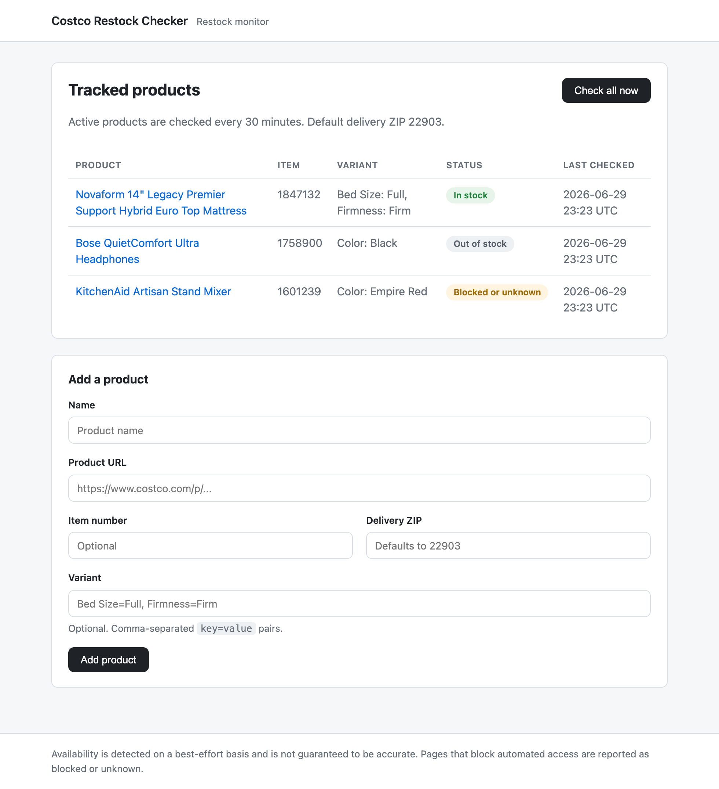

# Costco Restock Checker

[](https://github.com/robertwchen/costco_restock_checker/actions/workflows/tests.yml)

A scheduled service that monitors a Costco product page and sends an email or
SMS alert when a tracked item and variant becomes available for delivery to a
configured ZIP code.

It is built as a small, self-contained example of a scrape-and-alert service:
a FastAPI app, a Playwright-driven page checker, a SQLite store, a background
scheduler, and a minimal dashboard. The default tracked product is a Novaform
mattress (item 1847132, Full / Firm), and any other product URL can be added
from the dashboard.



## Features

- Scheduled availability checks at a configurable interval (default 30 minutes).
- Real-browser checking with best-effort delivery ZIP and variant selection.
- Three honest states: in stock, out of stock, and blocked or unknown.
- Restock alerts over email (Resend) and SMS (Twilio), each optional.
- Minimal dashboard to add, view, check, pause, and remove products.
- Stored check and alert history per product.
- Docker image, unit tests, and a GitHub Actions workflow.

## How it works

1. The scheduler runs every `CHECK_INTERVAL_MINUTES` and checks each active product.
2. For a product with an item number, Chromium loads the page to establish a
   session and a guest client identifier, then the checker queries Costco's
   inventory API for that item and ZIP and reads the authoritative
   `availableForSale` flag.
3. For products without an item number it falls back to the page's schema.org
   `Product` JSON-LD (matched by SKU or attributes), then to a text heuristic.
4. The result (`in_stock`, `out_of_stock`, or `blocked_or_unknown`) is stored.
   When an item transitions into stock, the configured alert channels fire once.

Blocks and bot challenges are reported as `blocked_or_unknown`, never
circumvented. The pure interpretation and classification functions are
unit-tested; the browser driver wraps them.

### A note on Costco specifically

Costco serves Akamai bot mitigation, so headless browsers are blocked and a real
(headed) browser is required — set `HEADLESS=false`. The page is loaded only to
obtain a guest client identifier (no login required); availability itself comes
from Costco's inventory API, which is ZIP-specific and authoritative. The page's
schema.org data is not used for items with a known number because it marks every
variant in stock regardless of the real per-ZIP state. Transient blocks return
`blocked_or_unknown` and are retried.

## Tech stack

Python 3.12, FastAPI, Jinja2, Playwright (Chromium), SQLAlchemy with SQLite,
APScheduler, Resend, Twilio, Docker, pytest, and GitHub Actions.

## Getting started

Requires Python 3.12.

```bash
python -m venv .venv
source .venv/bin/activate
pip install -r requirements.txt
playwright install chromium

cp .env.example .env   # then edit as needed
uvicorn app.main:app --reload
```

Open http://127.0.0.1:8000. The scheduler runs its first check one interval
after start; use Check now or Check all now to run immediately.

You can also check a single URL from the command line:

```bash
python -m app.checker "https://www.costco.com/p/..." --zip 22903
```

## Configuration

All settings are read from the environment (or a `.env` file).

| Variable | Default | Description |
| --- | --- | --- |
| `DELIVERY_ZIP` | `98101` | ZIP used when checking availability. |
| `CHECK_INTERVAL_MINUTES` | `30` | Minutes between scheduled checks. |
| `HEADLESS` | `true` | Run the browser headless. |
| `REQUEST_TIMEOUT_SECONDS` | `45` | Per-check navigation timeout. |
| `DATABASE_URL` | `sqlite:///./costco_restock.db` | SQLAlchemy database URL. |
| `ENABLE_SCHEDULER` | `true` | Start the scheduler on boot. |
| `RESEND_API_KEY` | empty | Resend API key (email). |
| `ALERT_EMAIL_FROM` | empty | Verified sender address. |
| `ALERT_EMAIL_TO` | empty | Recipient address. |
| `TWILIO_ACCOUNT_SID` | empty | Twilio account SID (SMS via Twilio). |
| `TWILIO_AUTH_TOKEN` | empty | Twilio auth token (or use the API key pair). |
| `TWILIO_API_KEY_SID` | empty | Twilio API key SID (preferred auth). |
| `TWILIO_API_KEY_SECRET` | empty | Twilio API key secret. |
| `TWILIO_FROM_NUMBER` | empty | Twilio sender number. |
| `TEXTBELT_API_KEY` | empty | TextBelt key (SMS via TextBelt). |
| `ALERT_SMS_TO` | empty | Recipient numbers, comma-separated E.164, shared by all SMS channels. |
| `SMS_INCLUDE_URL` | `false` | Include the product link in SMS (some gateways block links). |
| `CHECKER_MAX_ATTEMPTS` | `3` | Attempts per check before reporting blocked/unknown. |
| `CHECKER_RETRY_DELAY_SECONDS` | `6` | Delay between attempts. |

Each channel activates only when its values are present, and is skipped
otherwise:

- Email (Resend) needs `RESEND_API_KEY`, `ALERT_EMAIL_FROM`, and `ALERT_EMAIL_TO`.
- SMS via Twilio needs `TWILIO_ACCOUNT_SID`, a sender number, recipients, and
  either `TWILIO_AUTH_TOKEN` or the API key pair.
- SMS via TextBelt needs `TEXTBELT_API_KEY` and recipients. This is the simplest
  low-cost option: pay-as-you-go with no phone number or A2P 10DLC registration.
  Links are omitted from SMS unless `SMS_INCLUDE_URL=true`, since unverified keys
  cannot send URLs.

A check that comes back blocked/unknown is retried up to `CHECKER_MAX_ATTEMPTS`
times to ride out transient blocks, and restock detection ignores blocked
readings so a momentary block neither hides a restock nor causes a duplicate
alert.

## Running with Docker

```bash
cp .env.example .env
docker compose up --build
```

The image installs Chromium and its system dependencies plus Xvfb, and runs the
browser headed under a virtual display (Costco blocks headless). The SQLite
database is persisted on a named volume, and the app is served on
http://localhost:8000.

## Deployment

Alerts only fire while the app is running, so it needs a host that stays on. See
[DEPLOYMENT.md](DEPLOYMENT.md) for running on a home computer (recommended),
Docker on a server, or a cloud VM. Note that Costco's bot mitigation is more
aggressive toward data-center IPs, so a residential connection is the most
reliable place to run it.

## Testing

```bash
pip install -r requirements-dev.txt
ruff check .
pytest -m "not browser"   # fast unit tests, no browser
pytest -m browser         # end-to-end browser test (requires chromium)
```

CI runs the linter and the non-browser tests on Python 3.12.

## Project structure

```
app/
  main.py        FastAPI app, routes, and lifespan wiring
  config.py      Environment-based settings
  database.py    Engine, session factory, helpers
  models.py      Product, CheckResult, AlertLog
  seed.py        Default tracked product
  checker.py     Playwright driver and HTML classifier
  services.py    Check, store, restock detection
  alerts.py      Resend email and Twilio SMS
  scheduler.py   APScheduler interval job
  templates/     Jinja2 dashboard
  static/        Stylesheet
tests/           pytest suite
```

## Scope, limitations, and responsible use

- Availability detection is heuristic and best-effort. Page structure and bot
  mitigation change over time, so results are not guaranteed to be accurate and
  should not be relied on for purchasing decisions.
- The checker does not solve CAPTCHAs, use proxies, or attempt to evade bot
  detection. When a page is blocked or challenged it is reported as
  `blocked_or_unknown`. For Costco this means headless mode is blocked (run with
  `HEADLESS=false`) and some checks are throttled regardless.
- Costco Same-Day and Instacart sources are out of scope.
- SMS through a Twilio trial account is limited to predefined templates and
  verified numbers, so a paid account is required to deliver custom alerts.
- Use a conservative check interval and respect the target site's terms of use.

## License

MIT. See [LICENSE](LICENSE).
